# Rapport TP1 : Introduction à Docker

**Réalisé par :** RAKI Wiame


## Exercice 1 : Premiers pas

**Commande exécutée :**

```bash
docker run hello-world
```
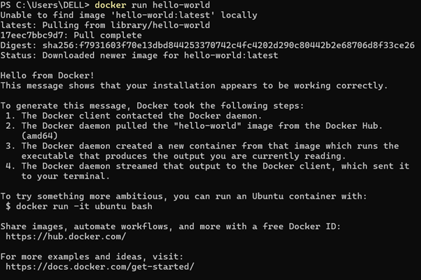
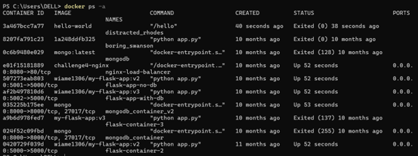
**Observation :**
Le message de succès confirme que l'installation est fonctionnelle.
Ensuite, la commande `docker ps -a` affiche tous les conteneurs présents sur la machine, y compris ceux qui sont arrêtés (statut *Exited*), ce qui permet de voir l'historique des exécutions.


## Exercice 2 : Images et Conteneurs

### Question 2.a : Définitions

  * **Image Docker :** C'est un modèle figé (une *template*) contenant tout le nécessaire pour lancer une application : système de fichiers, dépendances, bibliothèques, code, etc. Elle est immuable et sert de référence.
  * **Conteneur Docker :** C’est une instance en cours d’exécution d’une image. C’est l’application réellement lancée, possédant son propre état, ses fichiers temporaires et ses variables d’environnement. On peut créer plusieurs conteneurs distincts à partir d’une même image.

### Exécution d'Alpine

**Commande :**

```bash
docker run alpine echo "Bonjour depuis un conteneur Alpine"
```
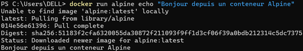
**Analyse :**
Docker a d'abord téléchargé l’image `alpine` (pull) depuis le Docker Hub car elle n'était pas présente localement. Ensuite, il a créé un conteneur, exécuté la commande `echo`, puis affiché le résultat.
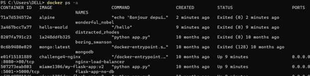
Le conteneur passe immédiatement au statut *Exited* une fois la commande `echo` terminée, car le conteneur n'a pas de processus persistant pour le maintenir en vie.

### Isolation

**Commande :**

```bash
docker run -it alpine sh
```
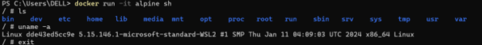

&nbsp;
**Observation :**
Les commandes `ls` et `uname -a` exécutées dans le conteneur montrent qu'il possède son propre système de fichiers, isolé de l'hôte. Cependant, il partage le noyau Linux de l'hôte (ou de la machine virtuelle WSL2 sous Windows), ce qui confirme que Docker utilise une virtualisation légère au niveau de l'OS.


## Exercice 3 : Création d'une image personnalisée

### Fichier `app.py`

```python
from fastapi import FastAPI

app = FastAPI()

@app.get("/health")
def health():
    return {"status": "ok"}
```

### Fichier `Dockerfile`

```dockerfile
# Dockerfile

# Image de base Python
FROM python:3.10-slim

# Définir le répertoire de travail
WORKDIR /app

# Copier le code source
COPY app.py /app

# Installer les dépendances
RUN pip install fastapi uvicorn

# Commande de démarrage
CMD ["uvicorn", "app:app", "--host", "0.0.0.0", "--port", "8000"]
```

**Construction de l'image :**

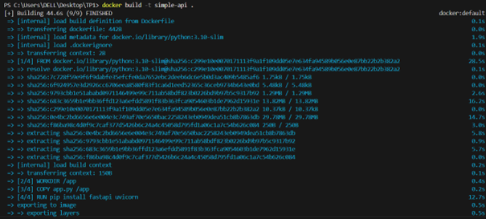

## Exercice 4 : Exécution et Ports

**Démarrage du conteneur :**

```bash
docker run -p 8000:8000 simple-api
```
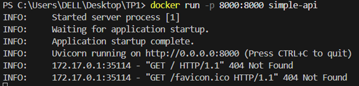


**Tests d'accès :**

1.  **Accès racine (`/`) :**
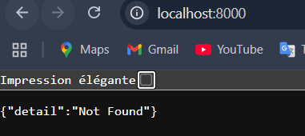
    Obtention d'une erreur `404 Not Found` car aucune route n'a été définie pour la racine `/` dans `app.py`.

2.  **Accès endpoint (`/health`) :**
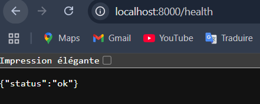
    Le JSON `{"status": "ok"}` est retourné correctement.

**Explication du mappage de port :**
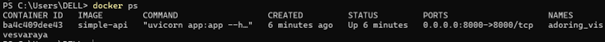
L'option `-p 8000:8000` connecte le port 8000 de la machine hôte au port 8000 du conteneur. Sans cela, l'API serait isolée à l'intérieur du réseau Docker et inaccessible depuis le navigateur.

**Analyse du conteneur (`docker ps`) :**

  * **Nom du conteneur :** `adoring_visvesvaraya`
  * **Image utilisée :** `simple-api`
  * **Port mappé :** `0.0.0.0:8000->8000/tcp`

**Différence entre les commandes :**
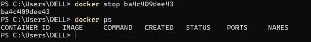
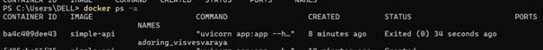
  * `docker ps` : Affiche uniquement les conteneurs **actifs** (en cours d'exécution).
  * `docker ps -a` : Affiche **tous** les conteneurs (actifs et arrêtés/terminés).


## Exercice 5 : Docker Compose

**Arborescence du projet :**
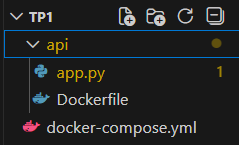
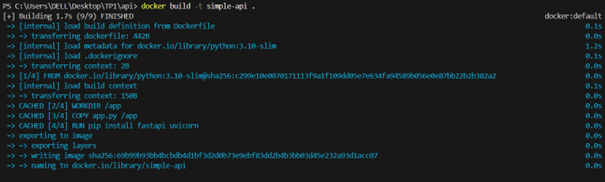
**Fichier `docker-compose.yml` :**

```yaml
version: "3.9"

services:
  db:
    image: postgres:16
    environment:
      POSTGRES_USER: demo
      POSTGRES_PASSWORD: demo
      POSTGRES_DB: demo
    ports:
      - "5432:5432"

  api:
    build: ./api
    ports:
      - "8000:8000"
    depends_on:
      - db
```

**Lancement de la stack :**

**Test de connexion :**
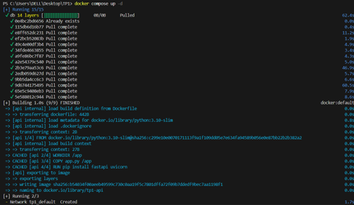
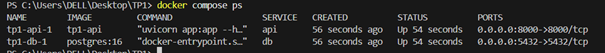
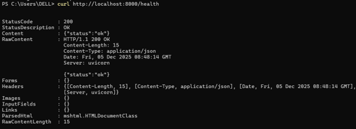
**Gestion du cycle de vie :**
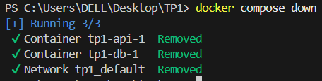
  * `docker stop <id>` : Arrête un conteneur spécifique tout en conservant son état et ses données temporaires. Il peut être relancé avec `docker start`.
  * `docker compose down` : Arrête et **supprime** tous les conteneurs et réseaux créés par le fichier Compose. C'est une méthode de nettoyage complète de l'exécution.


## Exercice 6 : Interaction et Maintenance

**Connexion à la base de données :**

```bash
docker compose exec db psql -U demo -d demo
```
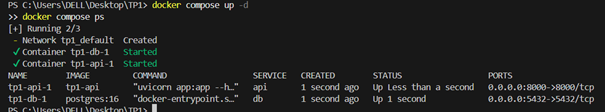
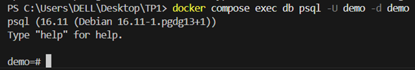
  * `exec` : Exécute une commande dans un conteneur actif.
  * `db` : Nom du service défini dans le docker-compose.
  * `-U` : Utilisateur PostgreSQL.
  * `-d` : Base de données cible.
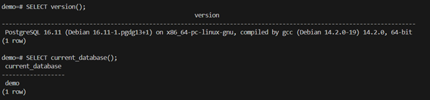

**Informations de connexion :**
Pour qu'un autre service (comme l'API) se connecte à la base de données, l'URI de connexion serait :
`postgresql://demo:demo@db:5432/demo`
*(Utilisateur : demo, Password : demo, Host : db, Port : 5432, DB : demo)*

**Nettoyage des volumes :**
La commande `docker compose down -v` est cruciale :

  * Sans `-v` : Les volumes (données de la BDD) sont conservés.
  * Avec `-v` : Les volumes sont supprimés, réinitialisant totalement la base de données à zéro.

**Redémarrage et Debugging :**
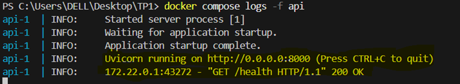
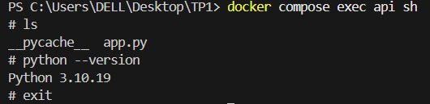
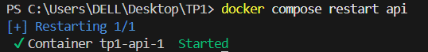
Le redémarrage (`docker compose restart api`) est utile pour :

1.  Appliquer des changements de configuration.
2.  Relancer un service planté (bug, fuite mémoire).
3.  Recharger l'application après une mise à jour mineure.

**Analyse des logs :**

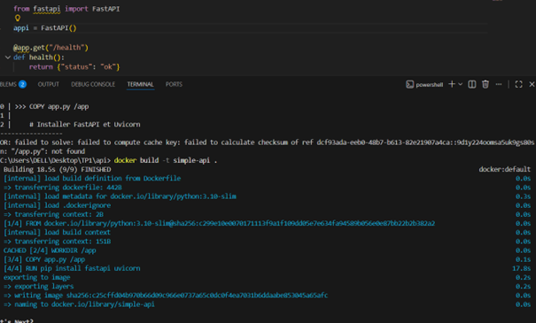
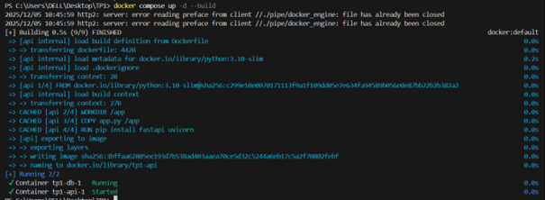
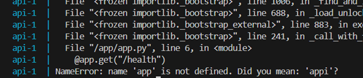
En cas d'erreur (ex: faute de frappe dans le code), `docker compose logs -f api` est l'outil principal pour diagnostiquer le problème (ici une `NameError`).

**Nettoyage final (Prune) :**
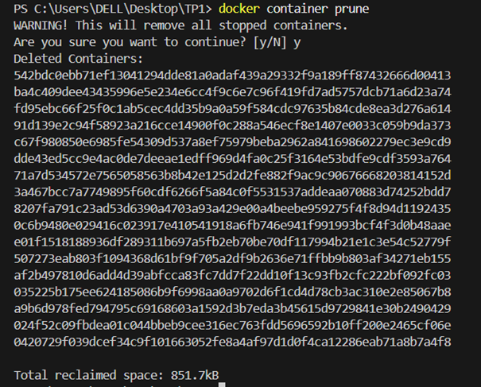
L'utilisation de `docker container prune` et `docker image prune` permet de supprimer les ressources inutilisées (conteneurs arrêtés, images sans tag). Cela libère de l'espace disque et évite les conflits potentiels lors de futurs déploiements.


## Exercice 8 : Questions de réflexion

### Question 8.a : Pourquoi un notebook Jupyter n’est-il pas adapté pour la production ?

Un notebook Jupyter est excellent pour l'exploration et le prototypage, mais inadapté pour le déploiement en production pour deux raisons majeures observées lors du TP :

1.  **Reproductibilité et Isolation :** Contrairement à une image Docker qui fige l'OS, les librairies et le code, un notebook dépend fortement de l'état de la machine locale. Il est difficile de garantir qu'il fonctionnera à l'identique sur un autre serveur.
2.  **Exécution et Automatisation :** Le TP a montré l'utilisation de `CMD` pour lancer automatiquement le serveur web. Un notebook nécessite une interaction manuelle pour exécuter les cellules, ce qui le rend impropre à agir comme un service autonome disponible 24/7.

### Question 8.b : Pourquoi Docker Compose est-il essentiel pour gérer plusieurs services ?

Docker Compose est indispensable pour orchestrer des architectures multi-services.

  * **Gestion centralisée :** Au lieu de lancer manuellement chaque conteneur avec des commandes `docker run` longues et propices aux erreurs (gestion des réseaux, liens, variables d'environnement), Docker Compose centralise toute la configuration dans un seul fichier YAML.
  * **Orchestration simple :** Comme vu dans le TP, une seule commande (`docker compose up -d`) suffit pour démarrer l'API et la base de données dans le bon ordre, connectées sur le même réseau virtuel, garantissant une communication fluide entre les services.