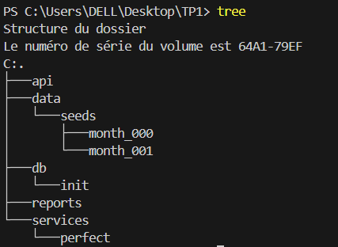
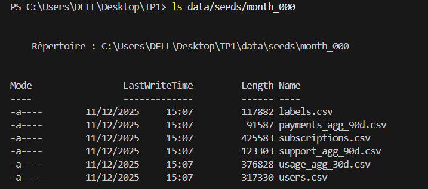
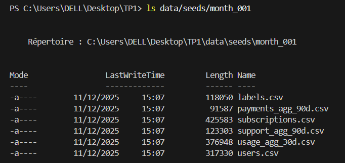
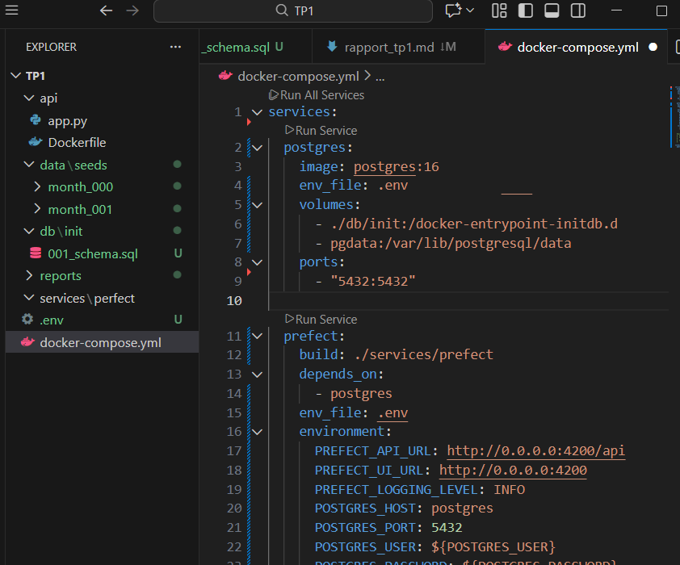
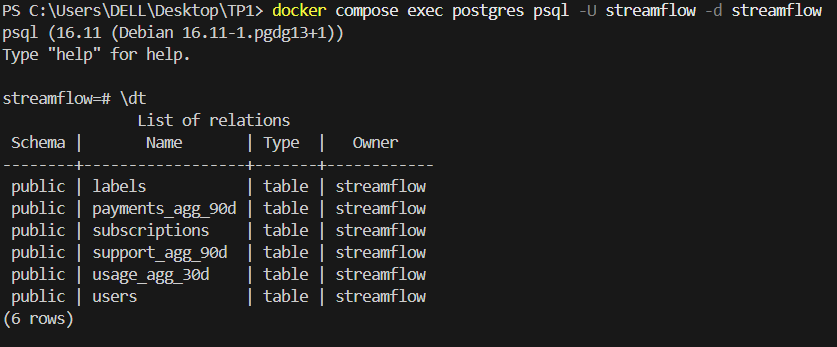
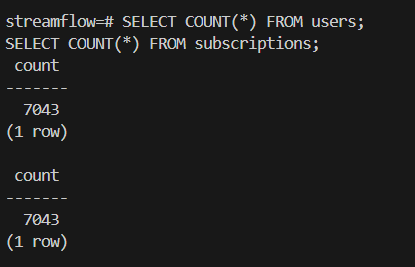
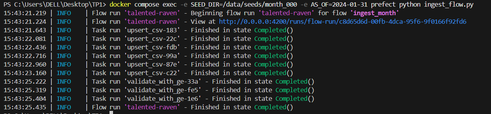
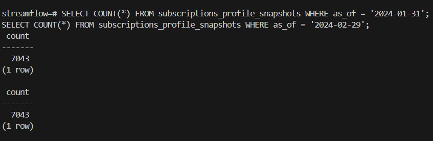

## Question 1.b:



## Question 1.c : Structure de données





## Question 2.a : 

Le schéma a été créé .
## Question 2.b:

Le fichier `.env` permet d'externaliser les variables de configuration (comme les identifiants de base de données) afin qu'elles ne soient pas écrites en dur dans le code, facilitant ainsi la sécurité et la portabilité entre différents environnements.
## Question 2.c:



## Question 2.d:



### Commentaires

* **labels** : contient la variable cible indiquant si un utilisateur a churné ou non.
* **payments_agg_90d** : regroupe les informations de paiements échoués d'un utilisateur sur les 90 derniers jours.
* **subscriptions** : décrit les caractéristiques du contrat et de l'abonnement de chaque utilisateur.
* **support_agg_90d** : regroupe les données relatives aux tickets support d'un utilisateur sur les 90 derniers jours.
* **usage_agg_30d** : contient les métriques d'utilisation du service par utilisateur sur les 30 derniers jours.
* **users** : recense les informations démographiques et générales de chaque utilisateur.

## Question3.a : Rôle du conteneur Prefect

Le conteneur Prefect agit comme chef d'orchestre. Il planifie les flux, gère les reprises sur erreur (retries), centralise les logs et s'assure que les tâches respectent leurs dépendances (par exemple : ne pas lancer la validation si l'ingestion a échoué).

## Question 3.b: Logique de la fonction upsert_csv

La fonction `upsert_csv` charge un fichier CSV dans une table Postgres en suivant une stratégie d'upsert. Elle crée d'abord une table temporaire pour stocker les données du CSV, convertit certaines colonnes si nécessaire (dates, booléens), puis insère les données dans la table cible en utilisant `INSERT ... ON CONFLICT ... DO UPDATE` pour mettre à jour les lignes existantes selon les clés primaires. Enfin, la table temporaire est supprimée.

## Question 3.c:



Après l'ingestion de month_000, nous avons 7043 clients dans la base.


## Question 4.a:

La fonction **`validate_with_ge`** sert à valider la qualité des données après leur ingestion dans la base PostgreSQL.
Pour chaque table, elle utilise Great Expectations afin de vérifier que les colonnes attendues sont présentes et que certaines valeurs numériques respectent des bornes logiques (par exemple, ≥ 0 pour les agrégats d’usage).
Si une expectation échoue, la fonction lève une exception, ce qui fait échouer le flow Prefect, garantissant ainsi que seules des données conformes sont conservées dans le pipeline.

## Question 4.b:




## Question 4.c:
## Validation des données

Pour la table `usage_agg_30d`, j'ai défini les expectations suivantes :

```python
# Vérifie que le nombre d'heures regardées sur 30 jours est positif
gdf.expect_column_values_to_be_between("watch_hours_30d", min_value=0)

# Vérifie que la durée moyenne des sessions sur 7 jours est positive
gdf.expect_column_values_to_be_between("avg_session_mins_7d", min_value=0)
```

### Choix des bornes

* **watch_hours_30d >= 0** : un utilisateur ne peut pas avoir regardé un nombre d’heures négatif.
* **avg_session_mins_7d >= 0** : la durée moyenne d’une session ne peut pas être négative.

Ces bornes (>= 0) sont critiques pour le Machine Learning. Si un modèle recevait des valeurs négatives pour une durée (ce qui est physiquement impossible), cela introduirait du bruit (noise) qui fausserait l'apprentissage. De plus, lors de la phase de feature engineering (ex: normalisation ou passage au log), des valeurs négatives pourraient provoquer des erreurs de calcul (ex: log d'un nombre négatif) et faire planter le pipeline d'entraînement.

## Question 5.b:




L’exécution des requêtes suivantes donnent:

* **0 enregistrement** pour la date du *31 janvier 2024* ;
* **7043 enregistrements** pour la date du *29 février 2024*.

Ces résultats indiquent que le snapshot correspondant au mois de janvier n’a pas été matérialisé, c’est-à-dire qu’aucune ligne n’a été insérée dans la table `subscriptions_profile_snapshots` pour la valeur `as_of = '2024-01-31'`. Cette situation peut s’expliquer par l’absence d’exécution du flow d’ingestion pour ce mois.

En revanche, le snapshot du mois de février affiche **7043 lignes**, ce qui signifie que la procédure de snapshot a correctement capturé l’état de la table `subscriptions` au moment de l’exécution du flow avec `AS_OF=2024-02-29`. Une ligne est ainsi stockée par utilisateur, associée à une date de référence (`as_of`), conformément au mécanisme de suivi temporel mis en place.


## Synthèse du TP2

### Schéma du pipeline d’ingestion (ASCII)

```
CSV month_000 --> Prefect flow --> Upsert dans tables principales
                                   |
                                   v
                        Validate_with_GE (qualité des données)
                                   |
                                   v
                         Snapshot tables par as_of
```

### Explication

* Nous ne travaillons pas directement sur les tables live pour entraîner un modèle afin de préserver l’intégrité et la stabilité des données. Les tables live peuvent évoluer et contenir des mises à jour partielles ou des erreurs temporaires.
* Les snapshots sont importants pour éviter la data leakage et pour garantir la reproductibilité temporelle : chaque snapshot capture l’état exact des métriques d’un mois donné, permettant de reconstruire exactement l’historique utilisé pour entraîner ou tester un modèle.
* *Pourquoi les snapshots évitent le Data Leakage ?* Si nous entraînions un modèle pour prédire le churn de Janvier en utilisant la table live (qui est mise à jour en continu), nous risquerions d'utiliser des données futures (ex: un pic de consommation ou un ticket support datant de Février) pour expliquer un événement passé. Le snapshot fige la vision exacte qu'on avait du client au 31 janvier, garantissant qu'aucune information du futur ne "fuite" dans les données d'entraînement.
### Réflexion personnelle

Le point le plus difficile dans la mise en place de l’ingestion a été de s’assurer que les données étaient correctement typées et cohérentes avant insertion, notamment pour les colonnes booléennes et numériques. J’ai rencontré plusieurs erreurs liées aux chemins de fichiers Docker et aux services non démarrés, que j’ai corrigées en vérifiant que les conteneurs Prefect et Postgres étaient bien en fonctionnement avant d’exécuter les flows.
