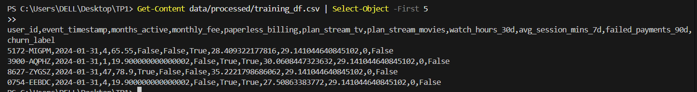

# Contexte
Le projet StreamFlow repose désormais sur une base de données PostgreSQL structurée, contenant des snapshots mensuels (mois 0 et 1) et couvrant divers aspects métier (profils utilisateurs, usage, abonnements, paiements, support). L'objectif de ce TP3 est d'interconnecter ces données brutes avec le Feature Store Feast. Cette étape clé permettra de standardiser l'accès aux données : nous mettrons en place la récupération de features en mode offline pour la constitution des jeux d'entraînement, et en mode online pour servir les données en temps réel via une API FastAPI, préparant ainsi le terrain pour le futur modèle de prédiction de churn
# Mise en place de Feast


### **Commande utilisée pour démarrer les services**

```bash
docker compose up -d --build
```


### **Rôle du conteneur `feast` **

Le conteneur **feast** contient l’environnement d’exécution du *Feature Store*.
La configuration du Feature Store (feature_store.yaml, registres, sources, definitions) se trouve dans le conteneur sous le dossier `/repo`, monté depuis `./services/feast_repo/repo`.
Ce conteneur sera utilisé pour gérer le store via des commandes telles que :

```bash
docker compose exec feast feast apply
docker compose exec feast feast materialize
```

(ce qui permet de déclarer les features, mettre à jour le registry et matérialiser les données dans la base PostgreSQL).


# Définition du Feature Store

Dans Feast, une *Entity* représente l’identifiant logique qui permet de relier l’ensemble des features à un même objet du monde réel (par exemple un utilisateur, un produit ou une transaction). Elle définit la clé de jointure utilisée pour associer les données du Feature Store aux données d’inférence. Dans notre cas, l’entité est `user`, et la clé `user_id` est un choix pertinent pour StreamFlow car elle identifie de manière unique chaque utilisateur dans toutes les sources de données, garantissant une correspondance cohérente et fiable entre les features historiques et les requêtes en production.

### **Exemple de table de snapshot dans le Feature Store**

Une des tables utilisées comme source pour le Feature Store est **`usage_agg_30d_snapshots`**.
Elle contient les colonnes suivantes :

* **user_id** : identifiant de l’utilisateur (clé de jointure)
* **as_of** : date du snapshot mensuel
* **watch_hours_30d** : nombre total d’heures regardées sur 30 jours
* **avg_session_mins_7d** : durée moyenne des sessions sur les 7 derniers jours
* **unique_devices_30d** : nombre d’appareils distincts utilisés sur 30 jours
* **skips_7d** : nombre de sauts/skip réalisés en une semaine

Chaque DataSource Feast sélectionne uniquement :
**user_id**, **as_of**, et les **colonnes de features** pertinentes pour cette table.
### feast apply
La commande `feast apply` permet de déployer les FeatureViews et la configuration du Feature Store définies dans le dépôt Feast. Elle crée ou met à jour les tables, les registres et l’infrastructure nécessaire pour rendre les features accessibles en ligne et hors ligne. En résumé, `feast apply` synchronise le code du repo Feast avec le système de stockage pour que les features puissent être utilisées en production ou pour l’entraînement des modèles.


Note: PowerShell ne reconnaît pas head.


Feast garantit la temporal correctness (ou point-in-time correctness) en s’assurant que, pour chaque entité et chaque date de référence, seules les features disponibles à cette date sont utilisées. Dans notre pipeline, chaque DataSource définit `timestamp_field="as_of"`, ce qui indique à Feast la colonne servant de référence temporelle pour les snapshots. De plus, `entity_df` contient `user_id` et `event_timestamp`, ce qui permet à `get_historical_features` de récupérer les valeurs exactes des features au moment de `event_timestamp`, évitant toute fuite de données provenant du futur.


# Récupération offline & online


**Dictionnaire retourné par get_online_features :**

```python
{'user_id': ['8627-ZYGSZ'],
 'months_active': [47],
 'paperless_billing': [True],
 'monthly_fee': [78.9000015258789]}
```

**Explication :**
Lorsque `get_online_features` est appelé pour un `user_id` dont les features ont été matérialisées dans l’online store, Feast retourne les valeurs correspondantes.
Si on interroge un `user_id` qui n’a pas de features matérialisées (par exemple un utilisateur inexistant ou dont les snapshots n’ont pas été ingérés), Feast retournera `None` pour chacune des features demandées.


Voici la réponse renvoyée par l’endpoint `/features/{user_id}` pour l’utilisateur `7590-VHVEG` :

```json
StatusCode        : 200
StatusDescription : OK
Content           : {"user_id":"7590-VHVEG","features":{"user_id":"7590-VHVEG","months_active":1,"paperless_billing":true,"monthly_fee":29.8500003814697}}
RawContent        : HTTP/1.1 200 OK
                    Content-Length: 136
                    Content-Type: application/json
                    Date: Fri, 12 Dec 2025 09:33:35 GMT
                    Server: uvicorn

                    {"user_id":"7590-VHVEG","features":{"user_id":"7590-VHVEG","months_active":1,"paperless_billing":true,"monthly_fee":29.8500003814697}}
Forms             : {}
Headers           : {[Content-Length, 136], [Content-Type, application/json], [Date, Fri, 12 Dec 2025 09:33:35 GMT], [Server, uvicorn]}
Images            : {}
InputFields       : {}
Links             : {}
ParsedHtml        : mshtml.HTMLDocumentClass
RawContentLength  : 136

```

# Réflexion

Le endpoint `/features/{user_id}` permet de récupérer les mêmes features en ligne que celles utilisées pour l’entraînement, en utilisant le FeatureStore Feast. En garantissant la cohérence entre les données d’entraînement (offline) et celles servies en production (online), il réduit le training-serving skew, c’est-à-dire l’écart entre les distributions de features vues par le modèle pendant le training et celles reçues en production. Ainsi, le modèle reçoit des informations cohérentes et à jour pour chaque prédiction.

