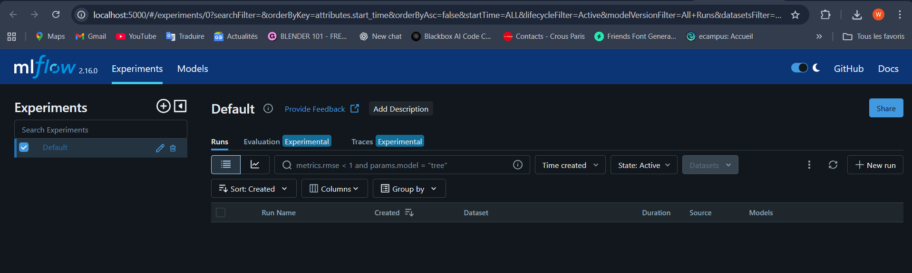
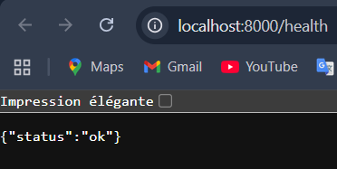
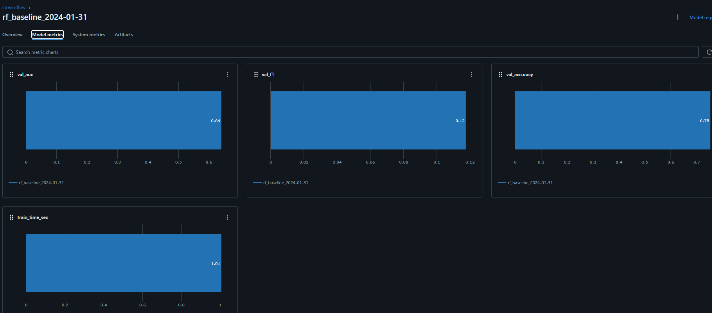
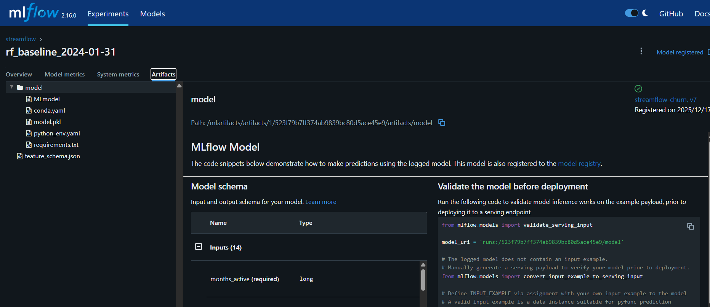
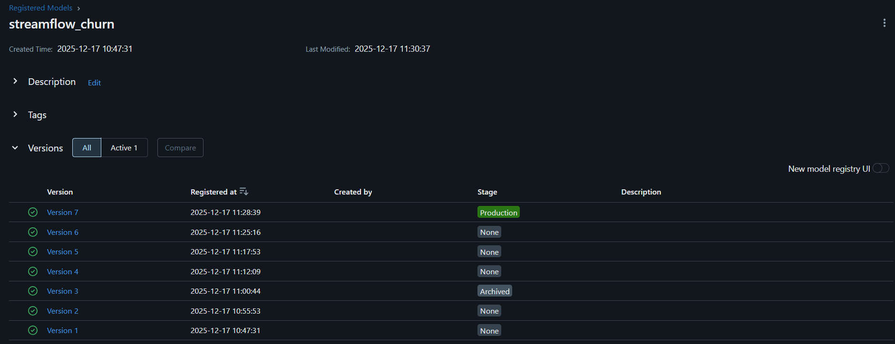
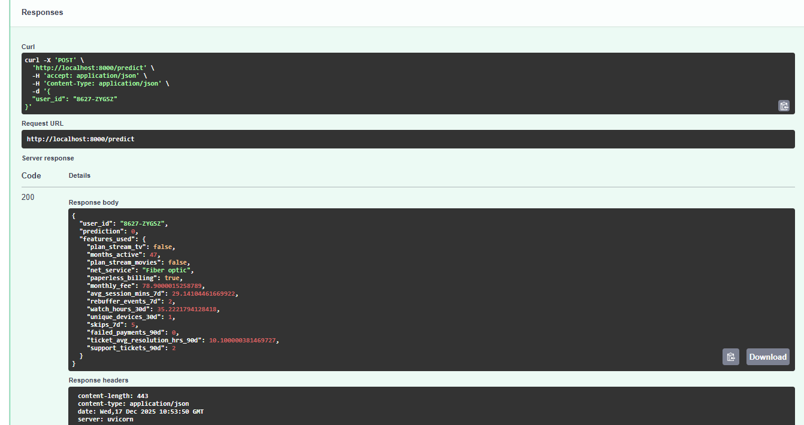
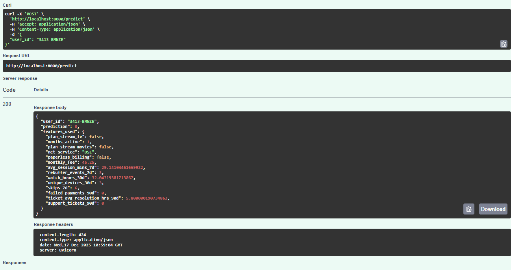
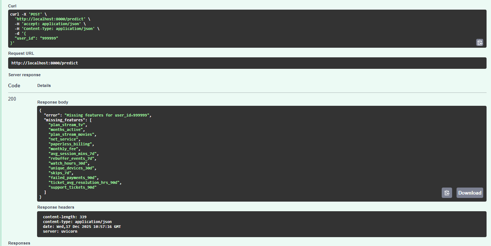

## 1. Commandes utilisées

```bash
# Premier démarrage  
docker compose up

# Démarrage / reconstruction de la stack
docker compose down
docker compose up -d --build

# Vérification de l’état des services
docker compose ps

# Tests d’accessibilité
http://localhost:5000
http://localhost:8000/health
http://localhost:8000/features/8627-ZYGSZ
```

---

## 2. Preuves d’accessibilité des services

### MLflow UI ([http://localhost:5000](http://localhost:5000))

* L’interface web MLflow est accessible depuis le navigateur.
* La page d’accueil s’affiche correctement, confirmant que le serveur MLflow est actif et à l’écoute sur le port 5000.
 

### API — Endpoint de santé `/health` ([http://localhost:8000/health](http://localhost:8000/health))

* L’endpoint `/health` est accessible et retourne statut ok.



### API — Récupération de features online `/features/8627-ZYGSZ`

* L’endpoint `/features/8627-ZYGSZ` est accessible.
* Les features online sont correctement retournées depuis Feast.


## 3. Composants en fonctionnement et justification

La stack déployée repose sur plusieurs composants complémentaires :

* **PostgreSQL** : base de données centrale utilisée par Prefect et pour le stockage persistant des métadonnées.
* **Prefect** : orchestrateur de workflows, responsable de l’exécution et du suivi des pipelines de données et de ML.
* **Feast** : feature store assurant la gestion et la récupération des features online utilisées par l’API.
* **API** : service exposant des endpoints REST permettant la récupération des features et la vérification de l’état du système.
* **MLflow** : outil de tracking des expérimentations ML, utilisé pour le suivi des runs, des métriques et des artefacts.

## 2.c. Résumé du training baseline

* **AS_OF utilisé :** `2024-01-31`
* **Nombre de lignes du dataset d’entraînement (après merge features + labels) :** `7043` 
* **Colonnes catégorielles détectées (`cat_cols`) :**

  ```
    ['net_service']
  ```
* **Métriques sur la validation :**

  * AUC : 0.6405
  * F1 : 0.1174
  * Accuracy : 0.7524
* **Temps d’entraînement :**  1.01 s


## 2.d. Importance de fixer AS_OF et random_state

Dans un pipeline **MLOps orienté reproductibilité** :

* **AS_OF** : permet de sélectionner une snapshot de données précise pour l’entraînement et les labels. Sans AS_OF fixé, on risque de récupérer des données différentes à chaque exécution, ce qui rend les runs non comparables et empêche de reproduire exactement les métriques.
* **random_state** : fixe les tirages aléatoires internes (split train/val, initialisation du modèle, échantillonnage). Cela garantit que le pipeline produit exactement les mêmes résultats (même split, même modèle entraîné) à chaque exécution.

 Fixer AS_OF et random_state est donc essentiel pour la traçabilité, la comparabilité des runs MLflow et la stabilité des modèles dans un contexte MLOps.




*Version7*
La promotion via une interface (Model Registry) est préférable car elle garantit la **traçabilité** et l'**immuabilité** de l'artefact : vous déployez exactement ce qui a été validé, éliminant le syndrome "ça marche sur ma machine" lié aux chemins locaux.

Le système de stages (Staging → Production) impose des **portes de validation** strictes, empêchant un modèle non testé d'impacter les utilisateurs finaux. Enfin, cela permet une gouvernance centralisée et auditable (qui a promu quoi et quand ?), facilitant l'automatisation CI/CD sécurisée là où la manipulation manuelle de fichiers est source d'erreurs humaines critiques.

## Requête réussie :

``` JSON
    {
  "user_id": "8627-ZYGSZ",
  "prediction": 0,
  "features_used": {
    "plan_stream_tv": false,
    "months_active": 47,
    "plan_stream_movies": false,
    "net_service": "Fiber optic",
    "paperless_billing": true,
    "monthly_fee": 78.9000015258789,
    "avg_session_mins_7d": 29.14104461669922,
    "rebuffer_events_7d": 2,
    "watch_hours_30d": 35.2221794128418,
    "unique_devices_30d": 1,
    "skips_7d": 5,
    "failed_payments_90d": 0,
    "ticket_avg_resolution_hrs_90d": 10.100000381469727,
    "support_tickets_90d": 2
  }
}
```

L'utilisation de l'URI `models:/.../Production` découple le code de l'API de la version spécifique du modèle. Contrairement à un fichier local (difficile à versionner et déployer) ou un ID de run figé (qui obligerait à modifier le code à chaque réentraînement), le Model Registry agit comme une couche d'abstraction dynamique. Il permet de mettre à jour le modèle actif (via la promotion Staging → Production) sans redéployer l'application, tout en garantissant la gouvernance : seule une version explicitement validée et tracée est exposée aux utilisateurs finaux, assurant stabilité et auditabilité.

## Exercice 5:




### 3. Ce qui peut mal tourner en serving et comment on le détecte

En phase de serving, la disponibilité et la fraîcheur des données sont critiques. Deux problèmes majeurs peuvent survenir :

1. **Entité absente :** Le `user_id` demandé n'est pas présent dans l'Online Store (Redis/SQL). Cela arrive si l'utilisateur est nouveau et n'a pas encore été ingéré, ou s'il y a un décalage entre la création du compte et l'ETL. On le détecte via le code de l'API (qui retourne des `NaN` ou une erreur explicite comme ci-dessus) et en monitorant le taux de "Feature Hit Rate" (pourcentage de clés trouvées).
2. **Online store incomplet ou obsolète :** Si le job de matérialisation (`feast materialize`) échoue ou prend du retard, les données servies peuvent être périmées (au-delà du TTL) ou manquantes. Le modèle risque alors de prédire sur des données vieilles (silent failure) ou de planter. Pour détecter cela tôt, on met en place des alertes sur le succès des jobs de matérialisation et on monitore la métrique de "Feature Freshness" (âge de la dernière donnée mise à jour) directement dans Feast ou via des outils d'observabilité.

## Exercice 6 : Réflexion de synthèse (ingénierie MLOps)

**6.a. Garanties apportées par MLflow :**

* **Traçabilité des entraînements :** MLflow Tracking agit comme une "boîte noire" de l'expérience en enregistrant systématiquement le code (git commit), les données (via les paramètres `AS_OF`), l'environnement (dépendances) et les hyperparamètres qui ont produit un résultat donné. Cela permet de revenir sur n'importe quel entraînement passé pour comprendre sa genèse.
* **Identification des modèles servis :** Le Model Registry fournit une source unique de vérité. Il garantit que l'artefact chargé par l'API (via l'URI `models:/...`) est immuable et correspond exactement à la version binaire qui a été validée, éliminant les erreurs liées aux copies manuelles de fichiers `.pkl`.

**6.b. Signification du stage "Production" pour l'API :**

* **Sélection au démarrage :** L'API est codée pour demander "le modèle actuel en Production". Elle ne connaît pas la version spécifique (v1, v2...). Au redémarrage, elle résout ce lien symbolique vers la dernière version promue.
* **Impact déploiement :** Cela permet de **découpler** le cycle de vie du modèle de celui de l'application. On peut mettre à jour le modèle (promote v2 -> Production) sans avoir à modifier le code source de l'API ni à reconstruire l'image Docker, ce qui facilite le déploiement continu (CD).

**6.c. Points de rupture restants pour la reproductibilité :**
Même avec MLflow, la reproductibilité n'est pas totale si :

1. **Données sources mutables :** Si les données brutes dans PostgreSQL sont modifiées ou purgées après la création du snapshot, on ne peut plus régénérer les features à l'identique.
2. **Environnement non figé :** Si les versions des librairies dans `requirements.txt` ne sont pas strictement épinglées (ex: `pandas` au lieu de `pandas==2.0.3`), une mise à jour mineure peut changer les résultats ou casser le modèle.
3. **Aléatoire non maîtrisé :** Si le `random_state` n'est pas fixé partout (split train/test, initialisation du modèle), deux exécutions successives du même code donneront des modèles différents.