# Exercice 1 :

### 1. Les noms des conteneurs

D'après la colonne `NAME` de  `docker compose ps` :

* `streamflow-grafana`
* `streamflow-prometheus`
* `tp1-api-1`
* `tp1-feast-1`
* `tp1-mlflow-1`
* `tp1-postgres-1`
* `tp1-prefect-1`

### 2. Pourquoi `api:8000` et non `localhost:8000` ?

Prometheus utilise `api:8000` car à l'intérieur d'un conteneur Docker, **`localhost`** désigne le conteneur lui-même (Prometheus), il faut donc utiliser le nom du service (**`api`**) qui agit comme un nom de domaine interne pour que le DNS de Docker redirige la requête vers la bonne adresse IP du conteneur API sur le réseau privé.


```bash
docker compose up -d 
```
 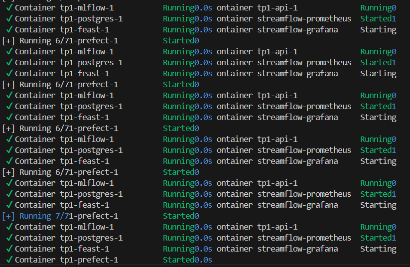 
 ```bash
docker compose ps 
```
 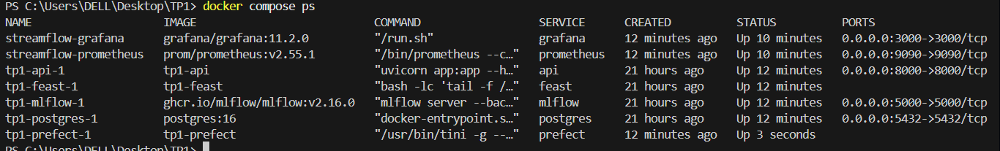 
 Prometheus 
 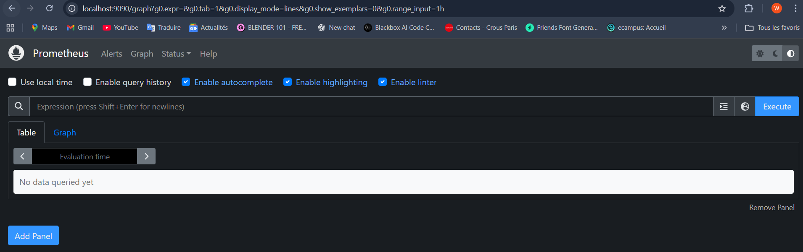
 Grafana 
 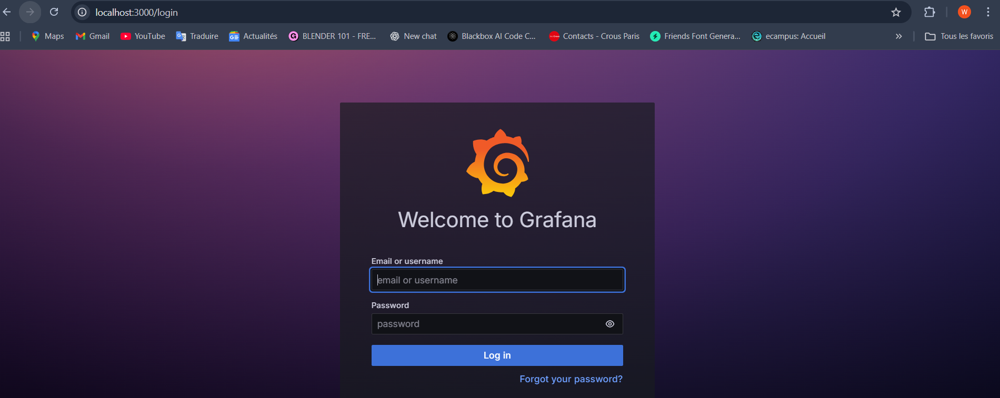 

# Exercice 2 :

### 1. Extrait des métriques (/metrics)

Metrics avant predict :
 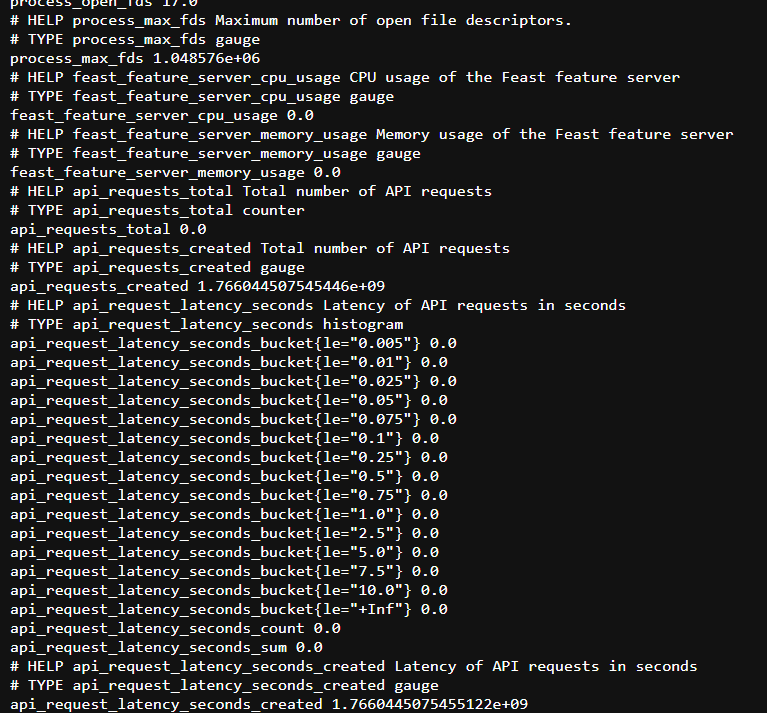 
Metrics avant predict :
 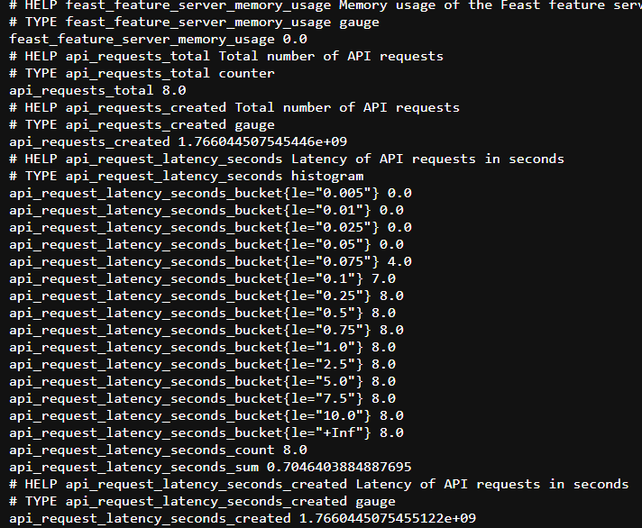 

### 2. Pourquoi un histogramme est plus utile qu’une moyenne

La moyenne est souvent trompeuse car elle masque les extrêmes : une seule requête très lente peut être "noyée" parmi mille requêtes rapides. L'histogramme est bien plus utile car il permet de calculer des **percentiles** (comme le P95 ou P99), montrant la latence ressentie par la majorité des utilisateurs et révélant les pics de lenteur (outliers) que la moyenne lisserait complètement. Cela est indispensable pour respecter des engagements de qualité de service (SLA).
 
# Exercice 3  :
## Interpretation des requêtes :
### 1. Requête : `up`

* **Observation :** La courbe est à 0 puis 1.
* **Interprétation :** C'est la métrique de santé la plus basique de Prometheus.
* **1** signifie que la cible (API) est accessible et que Prometheus arrive à lire les métriques (`/metrics`).
* **0** signifiet que le service est éteint ou inaccessible.


### 2. Requête : `api_requests_total`

* **Observation :** On voit une courbe en escalier qui monte (elle atteint 8 ) et reste plate quand vous n'envoyez pas de requêtes.
* **Interprétation :** C'est un **Compteur (Counter)**. Il affiche le nombre **cumulatif** total de requêtes reçues depuis le démarrage du conteneur. Cette valeur ne fait qu'augmenter et ne redescend jamais (sauf si l'API redémarre, auquel cas elle retombe à zéro).

### 3. Requête : `rate(api_requests_total[5m])`

* **Observation :** On voit un pic qui représente une activité, puis cela peut redescendre ().
* **Interprétation :** C'est une **dérivée** (vitesse). Cette fonction transforme le compteur cumulatif en **nombre de requêtes par seconde (RPS)**, moyenné sur une fenêtre glissante de 5 minutes.
* C'est la métrique pour surveiller la charge en temps réel (le "trafic" actuel) plutôt que l'historique total.


### 4. Requête : `rate(api_request_latency_seconds_sum[5m]) / rate(api_request_latency_seconds_count[5m])`

Cette valeur représente le **temps moyen de réponse** (la latence moyenne) d'une requête API, calculé sur une fenêtre glissante des 5 dernières minutes. Prometheus divise la *somme totale des durées* (`sum`) par le *nombre total de requêtes* (`count`) pour obtenir une moyenne arithmétique.

## Question 3.d :
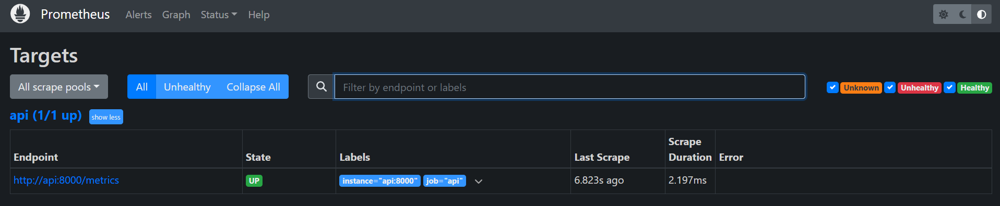 
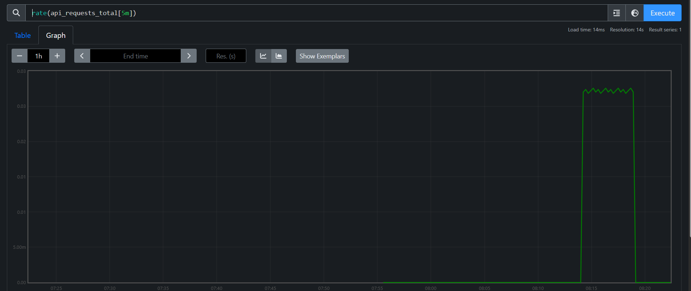 

# Exercice 4  :

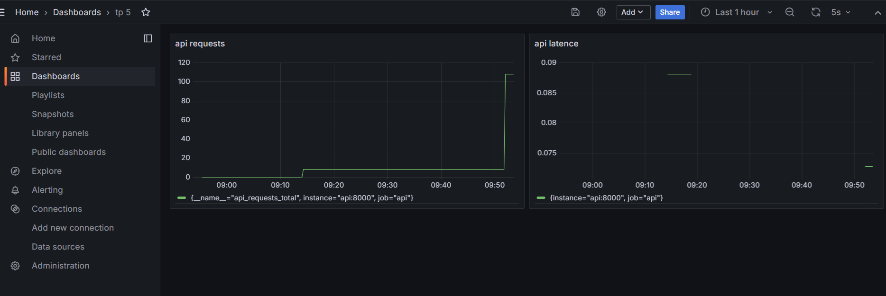 
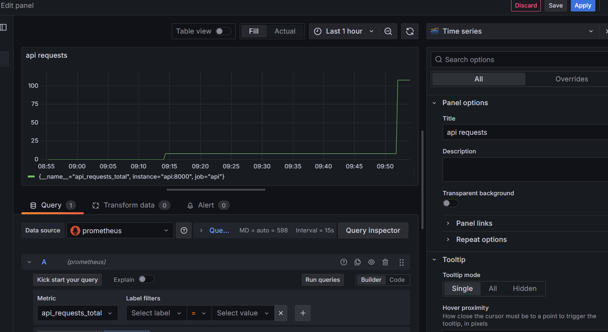 

Les métriques configurées (compteur de requêtes et histogramme de latence) sont idéales pour surveiller la santé opérationnelle de l'infrastructure : elles détectent immédiatement les pics de trafic, les lenteurs anormales ou les pannes de service. Cependant, elles sont "aveugles" concernant la qualité fonctionnelle du modèle. L'API pourrait répondre très rapidement (faible latence) tout en renvoyant des prédictions erronées ou incohérentes. Ces métriques ne permettent donc pas de détecter la dérive des données (data drift) ou une baisse de précision (accuracy) du modèle, qui nécessiteraient une surveillance spécifique des entrées et sorties.

# Exercice 5:
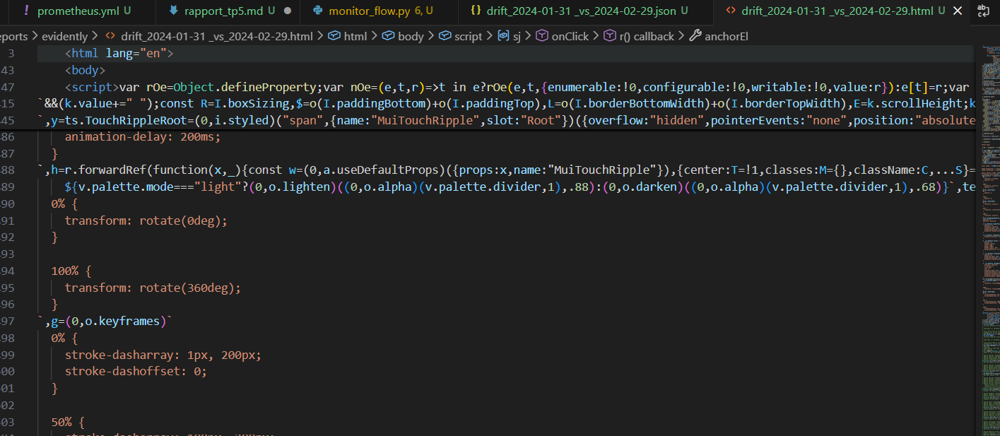 

### Difference entre Covariate Drift et Target Drift :

* **Covariate Drift (Dérive des Features) :** Les habitudes des utilisateurs changent.
* *Exemple :* Les clients regardent soudainement deux fois plus de vidéos (`watch_hours_30d` augmente), ou utilisent de nouveaux types d'appareils. Les données d'entrée (X) ne ressemblent plus à celles de l'entraînement.


* **Target Drift (Dérive de la Cible) :** Le résultat à prédire change.
* *Exemple :* Le taux réel de désabonnement (`churn_label`) passe brusquement de 5 % à 20 %. La distribution de la sortie (Y) a changé.


```bash
[Evidently] report_html=/reports/evidently/drift_2024-01-31 _vs_2024-02-29.html report_json=/reports/evidently/drift_2024-01-31 _vs_2024-02-29.json drift_share=0.00 -> NO_ACTION drift_share=0.00 < 0.30 (target_drift=0.0)
09:02:22.105 | INFO    | Flow run 'hysterical-bumblebee' - Finished in state Completed()
PS C:\Users\DELL\Desktop\TP1>
09:02:22.105 | INFO    | Flow run 'hysterical-bumblebee' - Finished in state Completed()
```