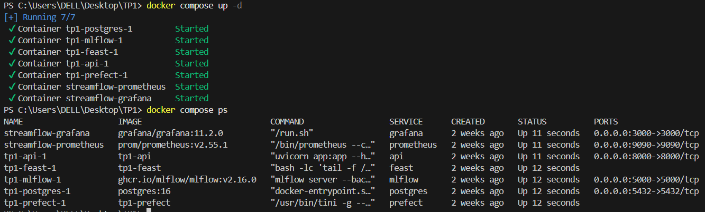
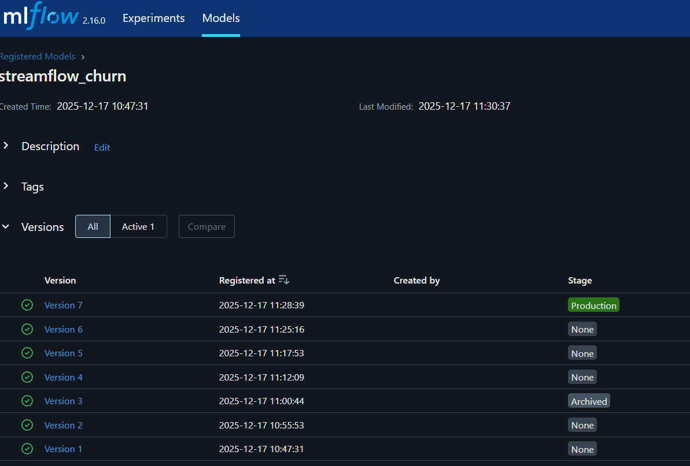
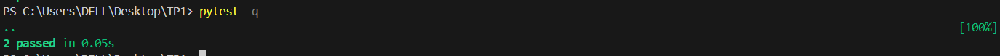
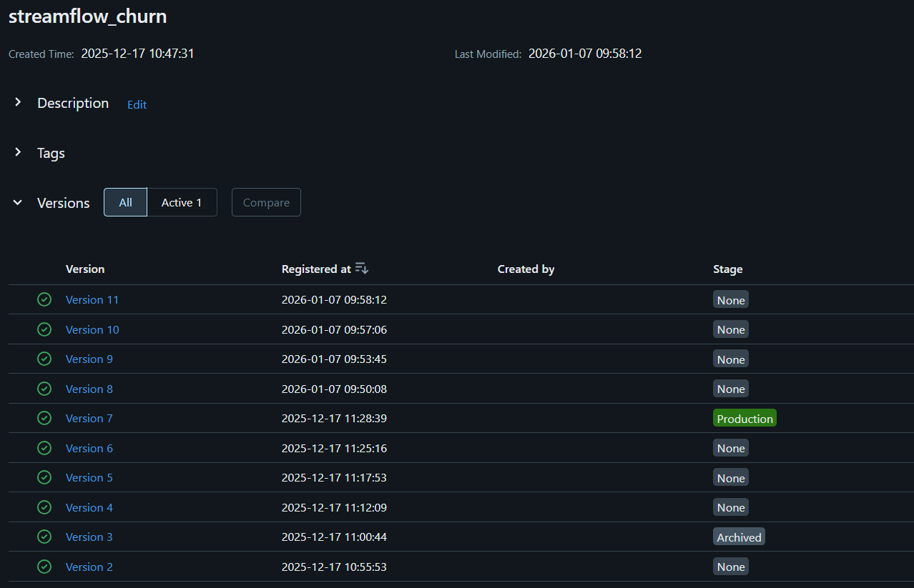
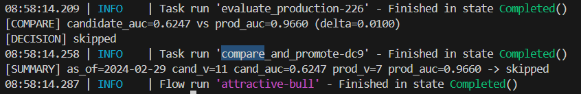
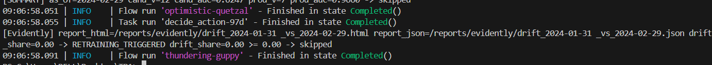
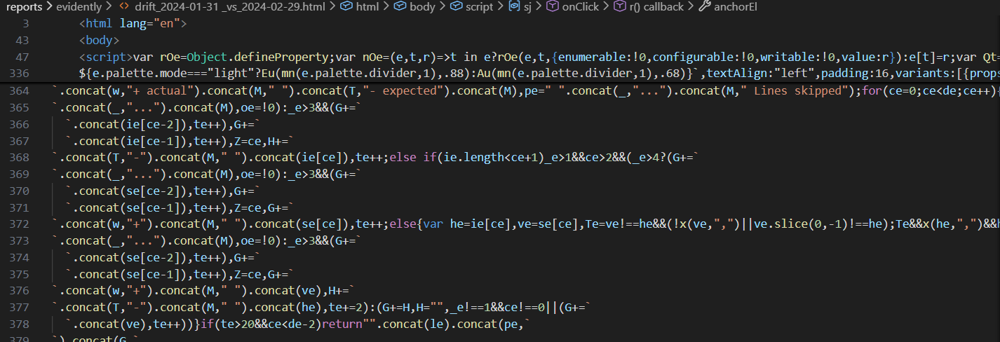
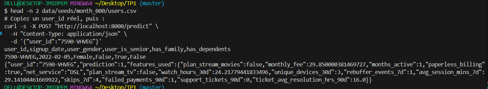
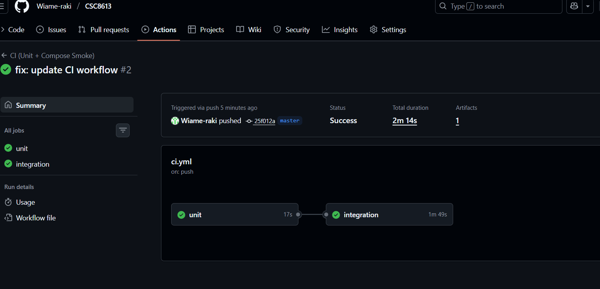

# Exercice 1:

 
 

# Exercice 2:
 
Extraire une fonction pure isole la logique décisionnelle de l'infrastructure, ce qui rend les tests unitaires totalement déterministes et instantanés car il n'est plus nécessaire de simuler (mocker) des dépendances externes complexes comme une base de données ou un registre de modèles.

# Exercice 3:
 
 
*J'ai plusieurs version None après la version en production car j'ai relancer le code plusieurs fois .*
On utilise un delta afin d’éviter de promouvoir un nouveau modèle pour des gains de performance trop faibles ou dus au hasard, et ainsi garantir que toute mise en production apporte une amélioration significative et stable par rapport au modèle existant.

# Exercice 4:
 

# Exercice 5: 

L’API doit être redémarrée car le modèle MLflow est chargé une seule fois au démarrage à partir du registre (stage *Production*), et une promotion de modèle n’est donc prise en compte qu’après un redémarrage permettant de recharger la nouvelle version en mémoire.

# Exercice 6: 

On démarre Docker Compose dans la CI pour valider que l'API et ses services dépendants (PostgreSQL, MLflow, Feast) démarrent correctement et communiquent ensemble, détectant ainsi les problèmes d'intégration multi-services avant qu'ils ne touchent la production.
# Synthèse : Boucle Complète Drift → Retrain → Promotion → Serving

## 1. Mesure du Drift et Seuil 0.02

Le **data drift** est détecté en comparant la distribution des données en production avec celle de l'ensemble d'entraînement. Dans notre pipeline, cette mesure utilise des métriques statistiques (Kolmogorov-Smirnov, Jensen-Shannon divergence, ou analyse d'histogrammes) sur les features numériques.

Le seuil de **0.02** (2%) représente une tolérance acceptable : si le drift dépasse cette valeur sur une feature critique, cela signale une déviation suffisante pour justifier un réentraînement. **En pratique**, ce seuil est souvent plus élevé (0.05 à 0.10) car un drift trop strict déclencherait des réentraînements inutiles et coûteux. Le choix du seuil dépend du secteur : en santé, il peut être très strict (0.01) ; en recommandation, il peut être plus tolérant (0.15).

## 2. Flow Train_and_Compare_Flow : Comparaison et Promotion

Le `train_and_compare_flow` (orchestré par **Prefect**) suit ce processus :

1. **Récupération des données** : Les données de validation depuis PostgreSQL
2. **Entraînement** : Un nouveau modèle est entraîné sur les données récentes
3. **Évaluation** : Le modèle est testé sur l'ensemble de validation ; la métrique clé est **val_auc** (Area Under Curve)
4. **Comparaison** : La `val_auc` du nouveau modèle est comparée avec celle du modèle en production (baseline)
5. **Décision de promotion** :
   - Si `new_auc > baseline_auc + threshold` → Le modèle est promu (enregistré dans MLflow, poussé en staging)
   - Sinon → Le modèle est rejeté, pas de promotion
6. **Enregistrement** : MLflow trace le modèle, ses métriques et ses hyperparamètres

Cette approche garantit qu'**un nouveau modèle ne remplace la production que s'il apporte une amélioration mesurable**.

## 3. Rôle de Prefect vs GitHub Actions

| Composant | Rôle |
|--|--|
| **Prefect** | **Orchestration métier** : gère les pipelines de données et ML (drift detection, entraînement, validation). Runs à intervalles réguliers (ex: quotidiens). Pas de dépendance au code source, focus sur l'exécution des modèles. |
| **GitHub Actions** | **CI/CD technique** : valide le code (unit tests), vérifie que les services tournent (smoke tests), et déploie les changements de code. S'exécute à chaque push/PR. Garantit la qualité du code, pas du modèle. |

Prefect gère quand et comment entraîner et GitHub Actions gère si le code est bon pour déployer.

## 4. Architecture Complète : Docker Compose en CI

**Pourquoi lancer Docker Compose dans la CI ?**

Le workflow d'intégration démarre les services **postgres**, **feast**, **mlflow**, et **api** pour valider que :
- L'API démarre sans erreur et répond aux health checks
- Les dépendances de services (PostgreSQL, MLflow) sont correctement configurées
- Le code déployé ne casse pas l'infrastructure existante

C'est un **test d'intégration multi-services** qui détecte les problèmes avant qu'ils ne touchent la production.

## 5. Limites et Améliorations

### Pourquoi la CI ne doit pas entraîner le modèle complet

1. **Temps d'exécution** : Entraîner un modèle complexe peut prendre 10+ minutes, ralentissant chaque PR
2. **Consommation de ressources** : Les runners GitHub seraient saturés
3. **Dépendances données** : L'entraînement nécessite des données réelles/volumineuses, pas disponibles en CI
4. **Non-déterministe** : Les résultats varient selon les données ; un test CI doit être reproductible

=> La CI valide le *code* (unit tests, syntax, imports) ; Prefect valide le *modèle* (performance réelle).

### Tests Manquants

- **Tests de stabilité numérique** : Vérifier que le modèle ne diverge pas sur des données extrêmes
- **Tests de cohérence des features** : S'assurer que les features Feast sont toujours disponibles et formatées correctement
- **Tests de latence** : Vérifier que les prédictions sont suffisamment rapides en production
- **Tests de monitoring** : Alertes si les métriques (drift, AUC, latence) dégradent

### Approbation Humaine et Gouvernance

En *production réelle, les décisions automatiques sont rarement suffisantes :

1. **Approbation avant promotion** : Un data scientist doit valider que le nouveau modèle a du sens métier (pas seulement une meilleure AUC)
2. **Audit trail** : Qui a approuvé ? Quand ? Pourquoi ? Pour les secteurs régulés (finance, santé)
3. **Rollback strategy** : Capacité à revenir au modèle précédent en cas de problème
4. **Feature importance & SHAP** : Expliquer les décisions du modèle, surtout pour les prédictions à enjeux
5. **A/B testing** : Tester le nouveau modèle sur 10% du trafic avant déploiement complet

=> La boucle automatisée (Prefect + GitHub Actions) est le fondation, mais elle doit être encadrée par des processus humains et des garde-fous pour garantir la conformité et la robustesse.
